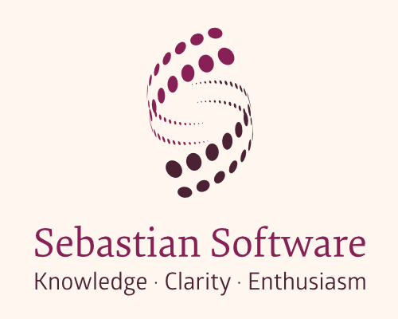

# PostCSS Load <br/>![Downloads][npm-version-img] ![Downloads][npm-downloads-img] [![Build Status][ci-img]][ci] ![Dependencies][deps-img]

[PostCSS] plugin for loading/including other files and quering/referring assets.

[PostCSS]: https://github.com/postcss/postcss
[ci-img]:  https://travis-ci.org/sebastian-software/postcss-load.svg
[ci]:      https://travis-ci.org/sebastian-software/postcss-load
[deps-img]: https://david-dm.org/sebastian-software/postcss-load.svg
[npm]: https://www.npmjs.com/package/postcss-load
[npm-downloads-img]: https://img.shields.io/npm/dm/postcss-load.svg
[npm-version-img]: https://img.shields.io/npm/v/postcss-load.svg

```css
@load "other.css";
```


## Links

- [GitHub](https://github.com/sebastian-software/postcss-load)
- [NPM](https://www.npmjs.com/package/postcss-load)


## Installation

Should be installed locally in your project source code:

```bash
npm install postcss-load --save-dev
```


## Usage

Integrate like this in your e.g. `gulpfile.js`:

```js
postcss([
  require("postcss-load")({
    // config
  })
])
```

See [PostCSS] docs for examples for your environment.


## Copyright



Copyright 2016<br/>[Sebastian Software GmbH](http://www.sebastian-software.de)

